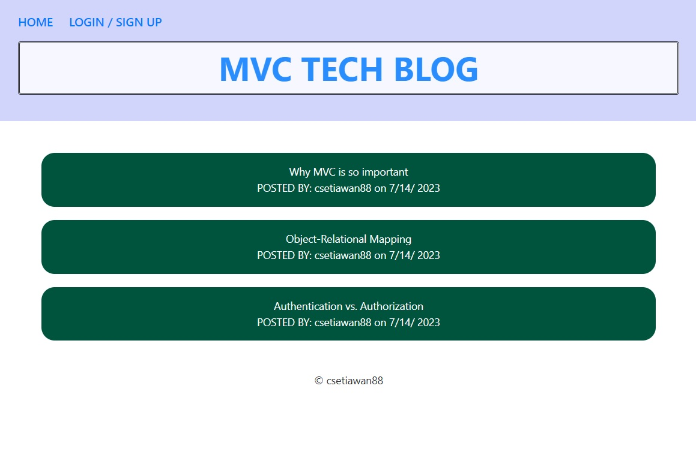
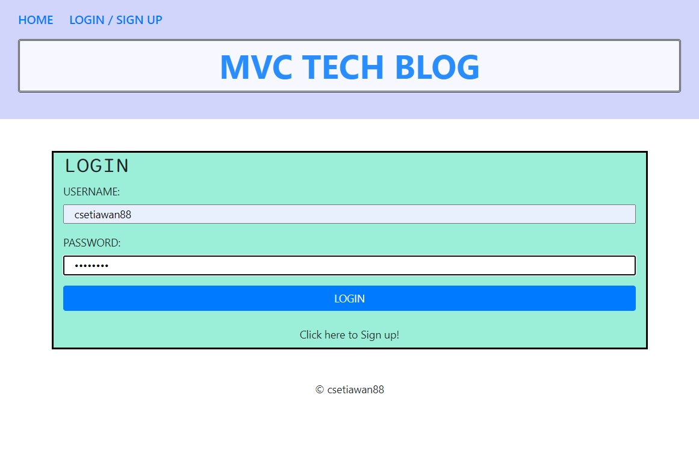
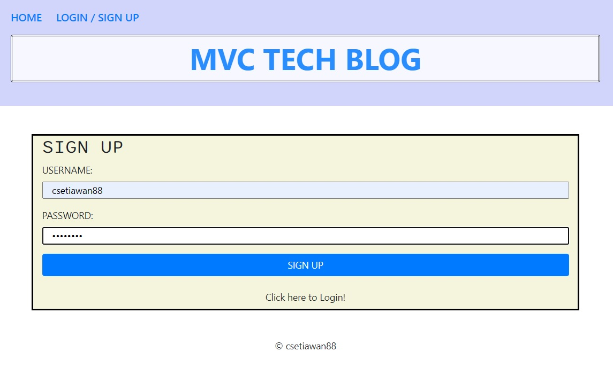
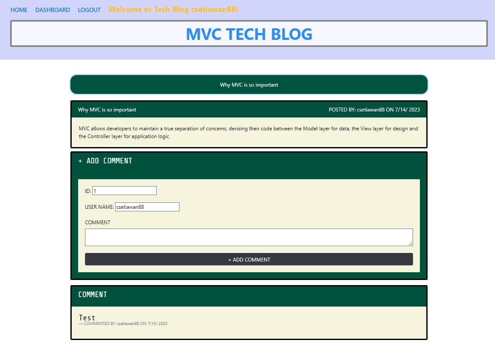
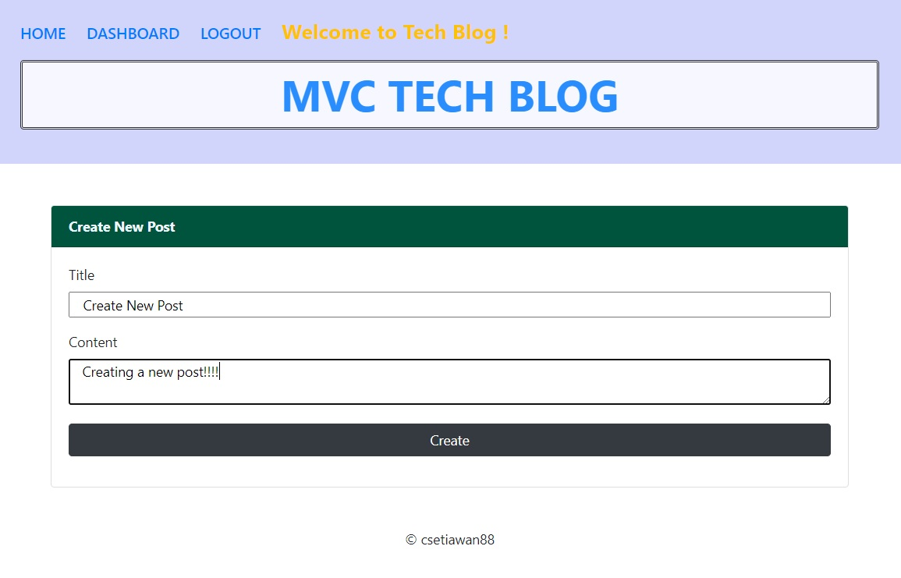
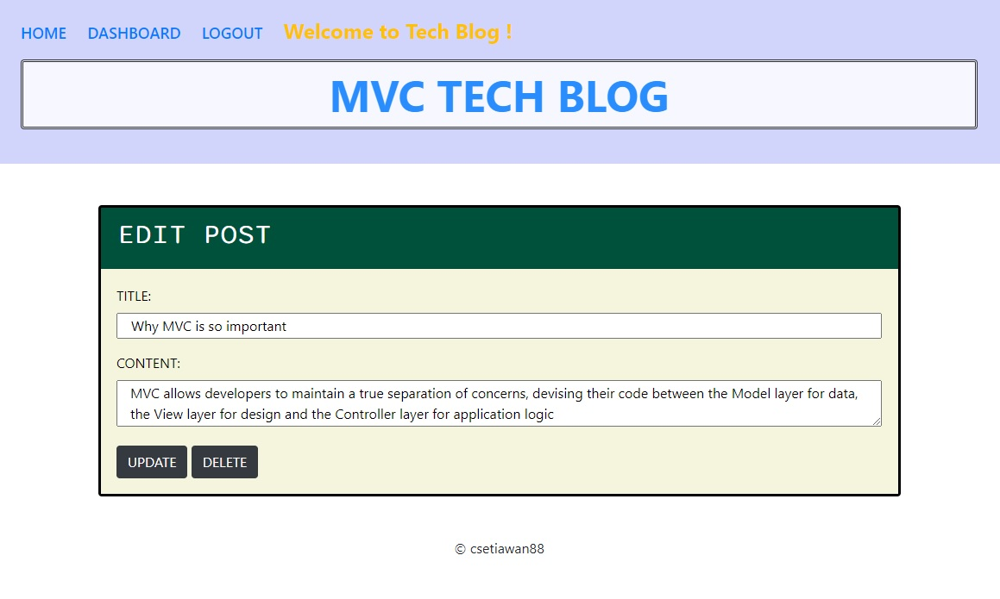

# Module 14 Challenge

# Model-View-Controller (MVC) Challenge: Tech Blog

## Description

Writing about tech can be just as important as making it. Developers spend plenty of time creating new applications and debugging existing codebases, but most developers also spend at least some of their time reading and writing about technical concepts, recent advancements, and new technologies. A simple Google search for any concept covered in this course returns thousands of think pieces and tutorials from developers of all skill levels!

My challenge this week is to build a CMS-style blog site similar to a Wordpress site, where developers can publish their blog posts and comment on other developers’ posts as well. You’ll build this site completely from scratch and deploy it to Heroku. Your app will follow the MVC paradigm in its architectural structure, using Handlebars.js as the templating language, Sequelize as the ORM, and the express-session npm package for authentication.

## User Story

- AS A developer who writes about tech
- I WANT a CMS-style blog site
- SO THAT I can publish articles, blog posts, and my thoughts and opinions

## Acceptance Criteria

- GIVEN a CMS-style blog site
- WHEN I visit the site for the first time
- THEN I am presented with the homepage, which includes existing blog posts if any have been posted; navigation links for the homepage and the dashboard; and the option to log in
- WHEN I click on the homepage option
- THEN I am taken to the homepage
- WHEN I click on any other links in the navigation
- THEN I am prompted to either sign up or sign in
- WHEN I choose to sign up
- THEN I am prompted to create a username and password
- WHEN I click on the sign-up button
- THEN my user credentials are saved and I am logged into the site
- WHEN I revisit the site at a later time and choose to sign in
- THEN I am prompted to enter my username and password
- WHEN I am signed in to the site
- THEN I see navigation links for the homepage, the dashboard, and the option to log out
- WHEN I click on the homepage option in the navigation
- THEN I am taken to the homepage and presented with existing blog posts that include the post title and the date created
- WHEN I click on an existing blog post
- THEN I am presented with the post title, contents, post creator’s username, and date created for that post and have the option to leave a comment
- WHEN I enter a comment and click on the submit button while signed in
- THEN the comment is saved and the post is updated to display the comment, the comment creator’s username, and the date created
- WHEN I click on the dashboard option in the navigation
- THEN I am taken to the dashboard and presented with any blog posts I have already created and the option to add a new blog post
- WHEN I click on the button to add a new blog post
- THEN I am prompted to enter both a title and contents for my blog post
- WHEN I click on the button to create a new blog post
- THEN the title and contents of my post are saved and I am taken back to an updated dashboard with my new blog post
- WHEN I click on one of my existing posts in the dashboard
- THEN I am able to delete or update my post and taken back to an updated dashboard
- WHEN I click on the logout option in the navigation
- THEN I am signed out of the site
- WHEN I am idle on the site for more than a set time
- THEN I am able to view posts and comments but I am prompted to log in again before I can add, update, or delete posts

## Install & Run the Application

1. Navigate to the develop folder using the command prompt.
2. Run `npm install` to install all dependencies. (List of dependencies shown on Technologies below)
3. Once everything is installed and updated with your information, run the following commands to create your database, tables to get started. 

```md
mysql - u root -p

<yourpassword>

SOURCE db/schema.sql;

exit
```
4. To run the application locally, run `node server.js` in your command prompt.
5. And then open `http://localhost:3001` in your browser.
6. To end your server in your command prompt type: Ctrl + c
7. Else click deployed site (HEROKU): 
8. Idle on the site for more than 3 minutes then will force logout.

## Repository & URL - Link

GITHUB: https://github.com/csetiawan88/techblog

URL:

## Contributing

csetiawan88 - https://github.com/csetiawan88/

## Screenshot

#### Tech Blog Home Page


#### Login Page


#### Sign Up Page


#### Comment Page


#### Create new Post


#### Update / Delete existing Post


## Technologies

- [CSS](https://developer.mozilla.org/en-US/docs/Web/CSS)
- [HTML](https://html.com/)
- [Bootstrap](https://getbootstrap.com/)
- [jquery](https://jquery.com/)
- [Express.js](https://expressjs.com/)
- [Node.js](https://nodejs.org/en/)
- [npmjs](https://docs.npmjs.com/)
- [inquirer](https://www.npmjs.com/package/inquirer)
- [Sequelize ORM](https://sequelize.org/)
- [dotenv](https://www.npmjs.com/package/dotenv)
- [handlebars](https://handlebarsjs.com/)
- [bcrypt](https://www.npmjs.com/package/bcrypt)

## Questions

If you have any additional questions, you can reach me at:
csetiawan@yahoo.com